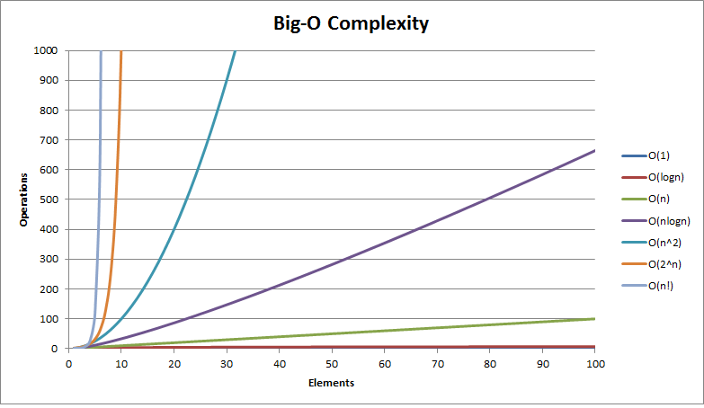

## Notes

**algorithm speed** - measured in **O(n)**.

**big O notation** - O(n)

**O(log⁡ n)** - divide and conquer search algorithm

**O(n)** — our linear search algorithm

**O(1)** — the program always takes the same number of steps regardless of how large the input is.

